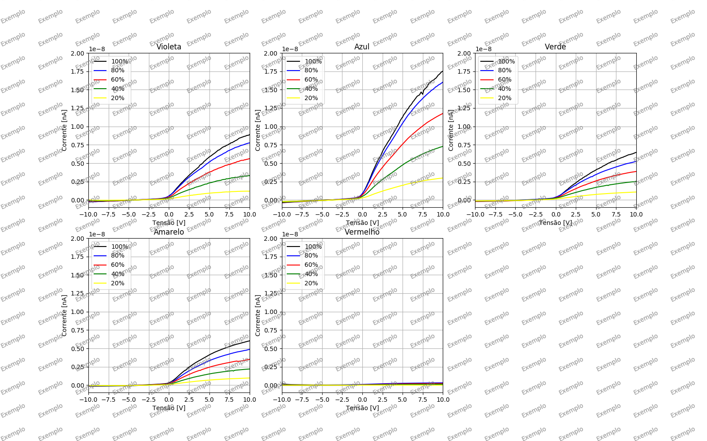

# Efeito Fotoelétrico
O objetivo desse programa é remover os ruídos dos dados do Experimento 1 de Física Experimental V.  
O programa pode ser encontrado clicando [aqui](https://github.com/MatheusJCastro/Code_Lab_V/) ou em:

> <https://github.com/MatheusJCastro/Code_Lab_V/>

## Formato dos arquivos
Os dados devem estar no formato: `DDMM_COR_INTENSIDADE.csv`  
Exemplo: `0503_amarelo_100.csv`  
O programa foi feito para funcionar com o arquivo original gerado pelo ProKeithley 6487.  
Todos os arquivos devem estar na mesma pasta em que o *medidas.py*.  

## Configuração
**Para configurar o programa abra o arquivo "*medidas.py*" e modifique as seguintes linhas:**
	
* Colocar os dias em que houve tomada de dados:
		
		dias = [...]
	
	Os dias devem estar no formado DDMM, entre aspas duplas (") e separados por vírgulas. Exemplo:
	
		dias = ["0503", "0603"]
	
* Modifique o `1` em `bias=1` e `lamp=1` para `0` caso não queria tirar algum dos tipos de ruído na linha:
	
		reduced = noise_removal(dt, noi_bias, noi_lamp, bias=1, lamp=1)
		
	O ruído `bias` se refere a medida tomada com a fenda da fotocélula
totalmente tampada. Já o `lamp` se refere a medida tomada com a lampada desligada.
		
### Salvar dados sem ruído em *.csv*

* Para salvar todos os dados sem o ruído no formato csv, descomente a linha:

		save_new_data(reduced)
		
	O programa criará uma pasta com o nome `reduced_data` e salvará todos os arquivo individualmente no mesmo formato dos arquivos de entrada, acrescentando apenas *"reduced"* no final de cada arquivo.  
	
	>**Atenção:** Cada vez que executado, o programa sobrescreve os arquivos que contêm o mesmo nome.

### Plotar e Salvar Gráficos

* Descomente essa linha para plotar todos os gráficos de frequência:

		plot_all(reduced, results_1, save=False, show_meth_1=False)

	Troque `False` para `True` em `save=False` caso queira salvar uma imagem png do gráfico.
	
	
	
* Descomente essa linha  plotar um gráfico de uma intensidade k (todas frequências):
		
		plot_same_intensity(reduced, results_1, save=False, k=100, show_meth_1=False)

	Troque `False` para `True` em `save=False` caso queira salvar uma imagem png do gráfico.
	
	
	

## Execução
Para rodar o código é necessario ter *Python3*, *Numpy* e *Matplotlib* instalados.  
Em sistemas linux rode o comando no terminal para executar o programa:
	
	python3 medidas.py

## Método 1
O método 1 consiste em pegar o ponto mais próximo de 0 e atribuir esse valor a V0. Para obter o resultado do método 1 para todos os gráficos, descomente a linha:

	results_1 = method_1(reduced, save=False)
	
Para salvar os resultados em um arquivo *.csv*, troque `False` para `True`. O programa cria a pasta `reduced_data` e salva o arquivo com nome "*1st_method_results.csv*" dentro dessa pasta.  
Há a possibilidade de plotar os resultados nos gráficos, para isso troque o `False` para `True` em `show_meth_1=False` nas linhas que habilitam o plot dos gráficos, conforme pode ser observado na seção **Plotar e Salvar Gráficos**.

> Para que o plot dos dados do método 1 funcione, é necessário que a linha que executa o método 1 esteja descomentada.