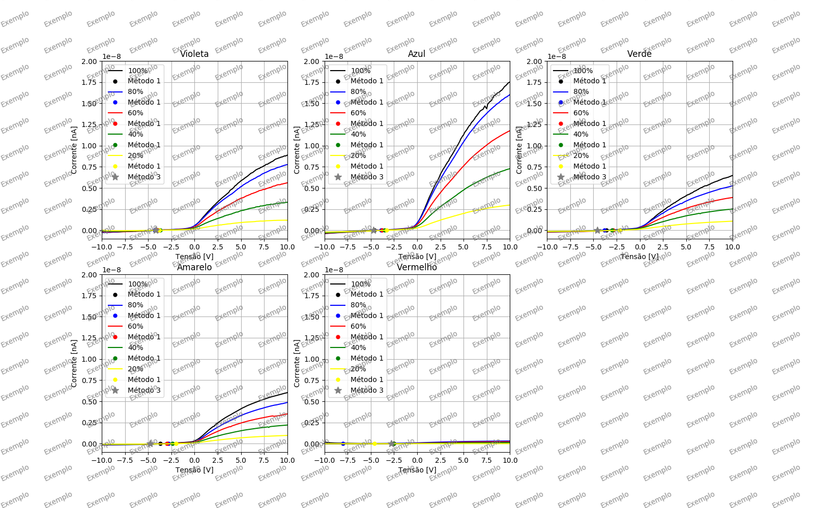

# Efeito Fotoelétrico
O objetivo desse programa é remover os ruídos dos dados do Experimento 1 de Física Experimental V. Também está disponível a análise dos métodos 1 e 3 conforme explicado abaixo.  
O programa pode ser encontrado clicando [aqui](https://github.com/MatheusJCastro/Code_Lab_V/) ou em:

> <https://github.com/MatheusJCastro/Code_Lab_V/>

## Formato dos arquivos
Os dados devem estar no formato: `DDMM_COR_INTENSIDADE.csv`  
Exemplo: `0503_amarelo_100.csv`  
O programa foi feito para funcionar com o arquivo original gerado pelo ProKeithley 6487.  
Todos os arquivos devem estar na mesma pasta em que o *medidas.py*.  

## Configuração
**Para configurar o programa abra o arquivo "*medidas.py*" e modifique as seguintes linhas:**
	
* Colocar os dias em que houve tomada de dados:
		
		dias = [...]
	
	Os dias devem estar no formado DDMM, entre aspas duplas (") e separados por vírgulas. Exemplo:
	
		dias = ["0503", "0603"]
		
## Execução
Para rodar o código é necessario ter *Python3*, *Tkinter*, *Numpy* e *Matplotlib* instalados.  
Em sistemas linux rode o comando no terminal para executar o programa:
	
	python3 medidas.py

Irá aparecer uma janela de pop-up para poder configurar e executar o programa.

## Remoção do Ruído
	
No primeiro campo, selecione os ruídos que deseja retirar. As opções são `Bias` e `Lamp`. Caso queira salvar todos os dados, marque a caixa de seleção `Salvar`. Depois clique em `Remover ruído`.  

> **Atenção:** Mesmo que não vá remover nenhum ruído, é necessario clicar em `Remover ruído`.

Se escolher salvar os novos dados, o programa criará uma pasta com o nome `reduced_data` e salvará todos os arquivo individualmente no mesmo formato dos arquivos de entrada, acrescentando apenas *"reduced"* no final de cada arquivo.  
	
>**Atenção:** Cada vez que executado, o programa sobrescreve os arquivos que contêm o mesmo nome.
		
O ruído `Bias` se refere a medida tomada com a fenda da fotocélula totalmente tampada. Já o `Lamp` se refere a medida tomada com a lampada desligada.

## Método 1
O método 1 consiste em pegar o ponto mais próximo de 0 e atribuir esse valor a V0.  
Para obter o resultado do método 1 para todos os gráficos, maruqe a caixa `1` em `Selecione os métodos que deseja calcular:`. Para salvar os resultados em um arquivo *.csv* marque a caixa de seleção do lado do botão `Calcular`. O programa cria a pasta `reduced_data` e salva o arquivo com nome "*1st_method_results.csv*" dentro dessa pasta.  
Há a possibilidade de plotar os resultados nos gráficos, para isso siga as instruções na seção **Plotar e Salvar Gráficos**.

## Método 3
O método 3 consiste em pegar a interseção das cruvas de intensidade de uma determinada frequência. Para isso o programa pega o valor em Volts da interseção de duas retas, dando como resultado a mediana dos valores.  
Para executar o método 3, maruqe a caixa `3` em `Selecione os métodos que deseja calcular:`. Para salvar os resultados em um arquivo *.csv* marque a caixa de seleção do lado do botão `Calcular`. O programa cria a pasta `reduced_data` e salva o arquivo com nome "*3st_method_results.csv*" dentro dessa pasta.  
Há a possibilidade de plotar os resultados nos gráficos, para isso siga as instruções na seção **Plotar e Salvar Gráficos**. 

### Plotar e Salvar Gráficos

* Para plotar todos os gráficos de frequência, selecione `Mostrar` e depois em `Gerar`. Para salvar, selecione tambám `Salvar`. Um exemplo do gráfico gerado pode ser observado na imagem a seguir:
	
	
	
* Para plotar um gráfico de uma intensidade k (todas frequências), selecione a intensidade desejada ao lado de `Escolha uma intensidade:`, selecione a caixa `Mostrar` e clique em `Gerar`. Para salvar, selecione tambám `Salvar`. Abaixo, um exemplo do gráfico gerado:
	
	
	
## Exemplo de Gráficos com os métodos 1 e 3 aplicados
Para plotar os gráficos mostrando os métodos que desejar, selecione as caixas abaixo de `Mostrar resultado dos métodos:`. e depois siga os mesmos procedimentos descritos em **Plotar e Salvar Gráficos**.  
Abaixo segue mais dois exemplos dos gráficos gerados:
	

